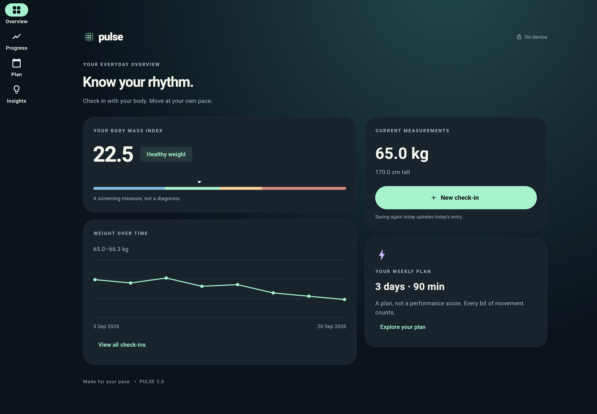

# Pulse · BMI & movement, version 2

A Flutter health and movement tracking application designed to help users understand their body measurements, build realistic activity routines, and track personal progress over time.

A Flutter upgrade of https://github.com/arshiadp/Bmi_calculator, rebuilt with **Riverpod 3**, a modern **ink/mint/lavender visual system**, guided measurement entry, responsive layouts, and a local progress journal.

The application focuses on turning health data into meaningful insights through a simple and user-friendly experience.

---

## Desktop Preview



---

## App Screenshots

### Guided Measurement Flow

Pulse provides a guided onboarding experience that helps users enter their measurements and create a personalized weekly movement plan.

<p align="center">
  
  
  
</p>


### Health Overview

The overview dashboard provides a complete summary of the user's current health information:

- Current measurements
- BMI calculation
- Weekly movement goals
- Quick check-in actions
- Personalized health summary

<p align="center">
  
</p>


### Weekly Activity Planning

Users can create realistic weekly movement goals by selecting active days and planned activity duration.

<p align="center">
  
</p>


### Health Insights

The insights section explains BMI, its limitations, and provides educational information based on trusted health references.

<p align="center">
  
</p>


---

# Run

Validated with **Flutter 3.47.5 / Dart 3.13.4**. Use the pinned stable version for reproducibility.

```sh
flutter pub get
flutter run
# Or in a browser:
flutter run -d chrome
```

```sh
flutter analyze
flutter test
flutter build web --release

# Android, with the Android SDK installed:
flutter build apk --debug

# iOS, on macOS with Xcode and CocoaPods:
flutter build ios --no-codesign
```

Android/iOS builds have not been run in the delivery environment. Android application ID and release signing are inherited from the original project (`com.example.bmi_calculator`, debug signing in the release block); configure your own ID and signing before publishing.

---

# What changed

- Three-step height, weight and weekly-plan flow inspired by the supplied reference.
- Ink background, slate cards, mint actions, lavender accents, bundled Roboto fonts.
- Metric and imperial units, fine sliders and validated typed entry.
- Adult BMI calculation with correct 18.5/25/30/35/40 boundaries. Category uses the unrounded value.
- Locally saved daily check-ins; another save on the same day updates that day.
- Date-scaled weight chart, history, individual deletion, copy-to-clipboard CSV and complete data reset.
- Weekly activity days/minutes, selectable week start, and an evenly spaced suggested schedule.
- Phone bottom navigation, desktop navigation rail and two-column overview.
- Loading, storage failure and corrupt-data recovery states; saves publish state only after storage succeeds.
- CDC/WHO context and source URLs, no calorie prescriptions or fabricated progress.
- GitHub Actions for formatting, analysis, tests and web compilation.

Measurements are constrained to 100–230 cm and 30–250 kg as product input limits, not medical thresholds.

The adult categories require confirmation of age 20+. BMI is a screening measure, not a diagnosis, and is not suitable for assessing pregnancy or children with these categories.

---

# Architecture

| Path | Responsibility |
| --- | --- |
| `lib/core` | Theme tokens and component styles |
| `lib/features/health/domain` | Pure Dart models, calculation, units, repository contract |
| `lib/features/health/data` | Versioned JSON storage through SharedPreferencesAsync |
| `lib/features/health/application` | Riverpod dependency injection, hydration and serialized persistence commands |
| `lib/features/health/presentation` | Onboarding, overview, history, plan, insights and shared widgets |
| `test` | Domain boundaries, controller behavior and responsive interaction tests |
| `tool/render_previews.dart` | Reproducible screenshots of actual Flutter widgets |

The repository can be replaced without changing the UI.

Immutable state flows from AsyncNotifier to consumers. Temporary form drafts, selected tabs and dialog state stay local to their widgets.

---

## Storage and Privacy

No account, analytics or backend is used.

Data is saved locally using:

```
pulse.health.v1
```

Shared preferences is lightweight local storage, not a clinical database.

On web, clearing site data removes the journal.

Calculations require no network once the application is loaded.

---

## Research and Scope

See:

[research decisions and primary sources](docs/RESEARCH.md)

Deferred features include:

- Backdated entry editing
- Custom training weekdays
- Reminders
- Encrypted storage
- RTL localization
- Platform file sharing
- Wearable integration

None of these are claimed as implemented in this version.

---

# Verification

- `flutter analyze`: no issues.
- `flutter test`: 13 passing tests.
- `flutter build web --release`: successful.
- Flutter screenshots rendered and visually reviewed.
- Responsive layouts tested at mobile and desktop sizes.

To regenerate preview images:

```sh
flutter test tool/render_previews.dart
```

Preview charts use isolated illustrative test fixtures.

The installed application starts without seeded history.

Font license:

```
assets/fonts/Roboto_LICENSE.txt
```
