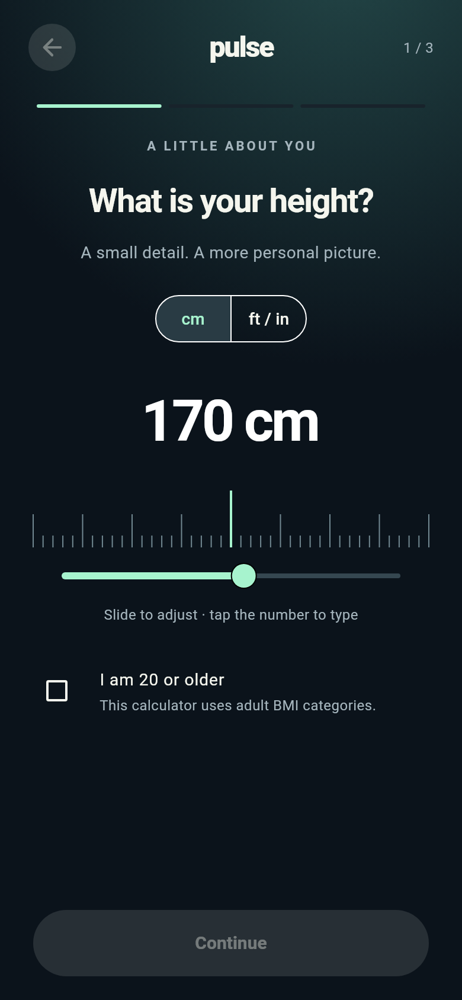
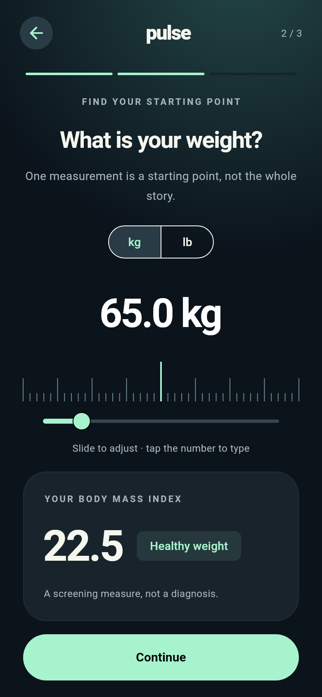
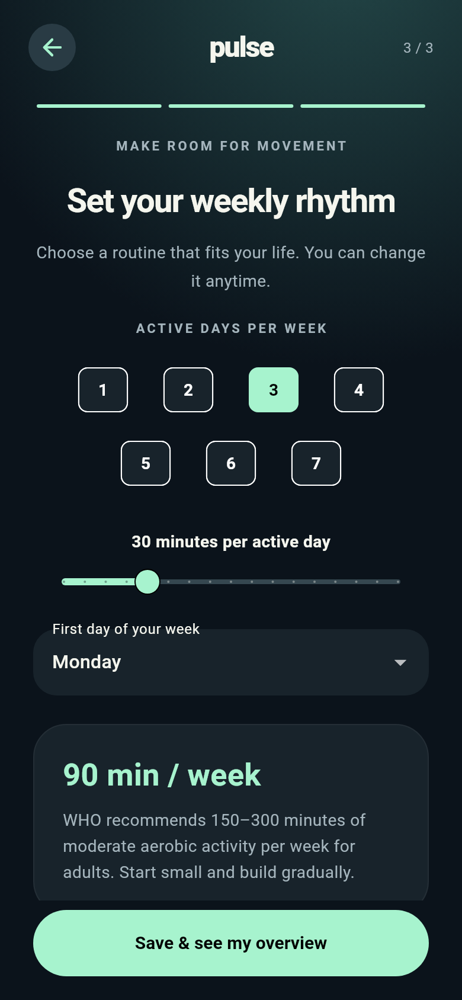
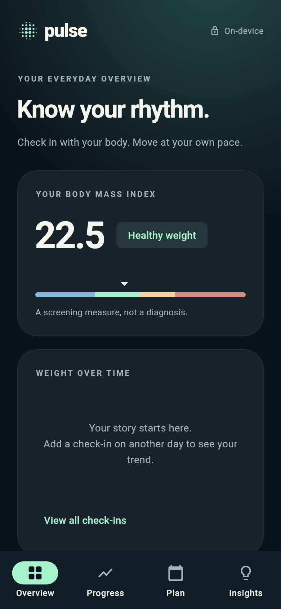
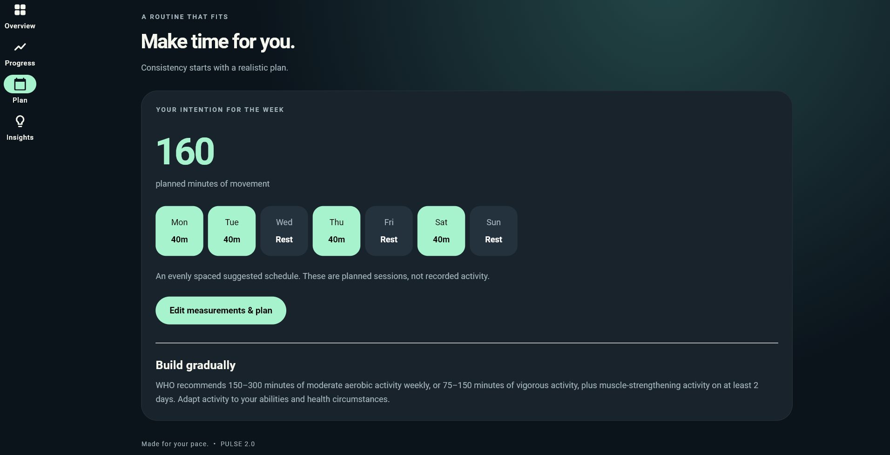
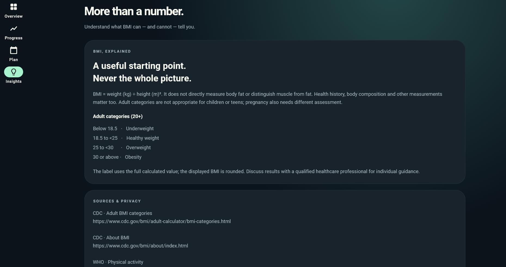

# Pulse · BMI & movement, version 2

A Flutter upgrade of https://github.com/arshiadp/Bmi_calculator, with Riverpod 3, an ink/mint/lavender visual system, guided measurement entry and a local progress journal.

## App Preview

### Guided measurement setup

Pulse starts with a simple guided onboarding flow where users enter their measurements and set up a realistic weekly movement plan.

<p align="center">
  
  
  
</p>

---

### Mobile overview

The overview screen gives users a quick snapshot of their BMI, measurements, and weekly activity target in a clean and focused interface.

<p align="center">
  
</p>

---

### Weekly plan experience

Users can review and adjust their movement routine through a responsive plan screen that highlights weekly minutes, active days, and a suggested schedule.

<p align="center">
  
</p>

---

### Health insights

The insights screen explains BMI clearly, shows category boundaries, and provides trusted source references so users understand the meaning and limits of their measurements.

<p align="center">
  
</p>

## Run

Validated with **Flutter 3.47.5 / Dart 3.13.4**. Use the pinned stable version for reproducibility.

```sh
flutter pub get
flutter run
# Or in a browser:
flutter run -d chrome
```

```sh
flutter analyze
flutter test
flutter build web --release
# Android, with the Android SDK installed:
flutter build apk --debug
# iOS, on macOS with Xcode and CocoaPods:
flutter build ios --no-codesign
```

Android/iOS builds have not been run in the delivery environment. Android application ID and release signing are inherited from the original project (`com.example.bmi_calculator`, debug signing in the release block); configure your own ID and signing before publishing. The platform deployment floors are iOS 13 and macOS 10.15 to match the persistence plugin. No hosted deployment or GitHub push is included.

## What changed

- Three-step height, weight and weekly-plan flow inspired by the supplied reference.
- Ink background, slate cards, mint actions, lavender accents, bundled Roboto fonts.
- Metric and imperial units, fine sliders and validated typed entry.
- Adult BMI calculation with correct 18.5/25/30/35/40 boundaries. Category uses the unrounded value.
- Locally saved daily check-ins; another save on the same day updates that day.
- Date-scaled weight chart, history, individual deletion, copy-to-clipboard CSV and complete data reset.
- Weekly activity days/minutes, selectable week start, and an evenly spaced suggested schedule.
- Phone bottom navigation, desktop navigation rail and responsive layouts.
- Loading, storage failure and corrupt-data recovery states; saves publish state only after storage succeeds.
- CDC/WHO context and source URLs, no calorie prescriptions or fabricated progress.
- GitHub Actions for formatting, analysis, tests and web compilation.

Measurements are constrained to 100–230 cm and 30–250 kg as product input limits, not medical thresholds. The adult categories require confirmation of age 20+. BMI is a screening measure, not a diagnosis, and is not suitable for assessing pregnancy or children with these categories.

## Architecture

| Path | Responsibility |
| --- | --- |
| `lib/core` | Theme tokens and component styles |
| `lib/features/health/domain` | Pure Dart models, calculation, units, repository contract |
| `lib/features/health/data` | Versioned JSON storage through SharedPreferencesAsync |
| `lib/features/health/application` | Riverpod dependency injection, hydration and serialized persistence commands |
| `lib/features/health/presentation` | Onboarding, overview, history, plan, insights and shared widgets |
| `test` | Domain boundaries, controller behavior and responsive interaction tests |
| `tool/render_previews.dart` | Reproducible screenshots of actual Flutter widgets |

The repository can be replaced without changing the UI. Immutable state flows from AsyncNotifier to consumers. Temporary form drafts, selected tabs and dialog state stay local to their widgets. Plain Navigator handles the single edit route; a router/code-generation layer would add little value at this size.

### Storage and privacy

No account, analytics or backend is used. Data is saved in `pulse.health.v1`. Shared preferences is simple, unencrypted storage, not a clinical record or durable database; OS/browser backup behavior applies. On web, clearing site data removes the journal. Calculations require no network once the app is loaded; this is not an offline-installable PWA guarantee. Copy CSV before clearing data. Plan edits currently share the check-in flow and save today's measurement too.

### Research and scope

See [research decisions and primary sources](docs/RESEARCH.md). Deferred features include backdated entry editing, custom training weekdays, reminders, encrypted storage, RTL localization, platform file sharing and wearable import. None is claimed as working in this version.

## Verification

- `flutter analyze`: no issues.
- `flutter test`: 13 passing tests.
- `flutter build web --release`: successful.
- Actual Flutter screenshots rendered and visually reviewed; onboarding, overview and navigation tested at different sizes.
- Native installation, real-device accessibility, browser interaction and app-store release signing still need platform testing.

To regenerate the preview images:

```sh
flutter test tool/render_previews.dart
```

Font license: `assets/fonts/Roboto_LICENSE.txt`.
